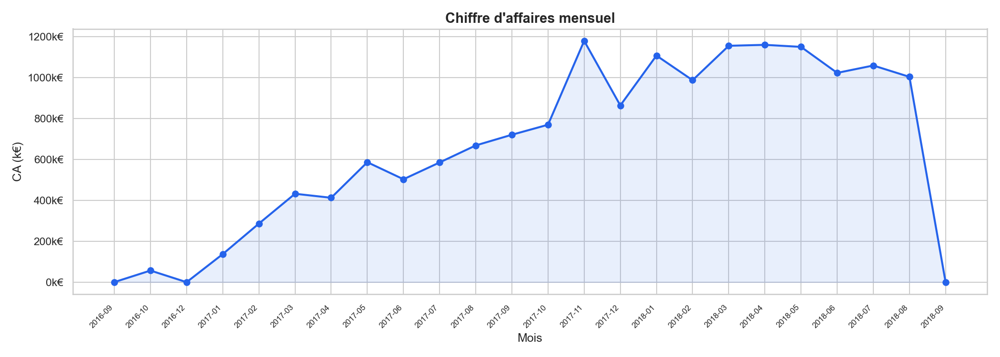
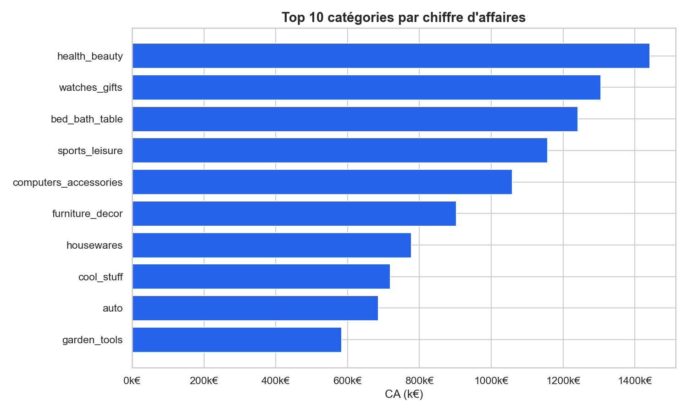
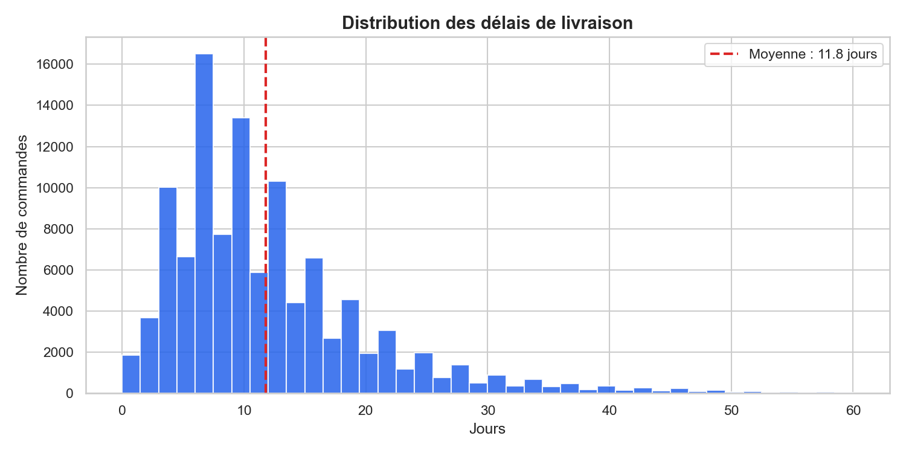

# 🛒 E-Commerce Sales Pipeline — Olist Dataset

> **Pipeline ETL complet d'analyse des ventes e-commerce | End-to-end ETL pipeline for e-commerce sales analysis**


---

## 🇫🇷 Présentation du projet

Ce projet implémente un **pipeline ETL (Extract → Transform → Load → Analyze)** complet sur le dataset public Olist (e-commerce brésilien, ~100 000 commandes).

L'objectif : transformer des données brutes multi-fichiers CSV en insights business exploitables, stockés en base SQL et visualisés automatiquement.

Ce projet fait écho à mon expérience chez **Bouygues Telecom** (pôle Big Data), où j'ai travaillé sur l'analyse du parcours client et l'efficacité des canaux marketing — ici appliqués à un contexte e-commerce.

### Ce que ce projet démontre

- Conception et orchestration d'un pipeline de données modulaire en Python
- Nettoyage et jointures multi-tables avec Pandas (9 sources hétérogènes)
- Calcul de KPIs e-commerce métier (CA, délais de livraison, top catégories)
- Persistance SQL avec SQLite et requêtes analytiques
- Génération automatique de visualisations avec Matplotlib/Seaborn

---

## 🇬🇧 Project Overview

This project implements a full **ETL pipeline (Extract → Transform → Load → Analyze)** on the public Olist dataset (Brazilian e-commerce, ~100,000 orders).

The goal: turn raw multi-file CSV data into actionable business insights, stored in a SQL database and automatically visualized.

This project mirrors work done during my 2-year apprenticeship at **Bouygues Telecom** (Big Data division), where I analyzed customer journeys and marketing channel performance — here applied to an e-commerce context.

### What this project demonstrates

- Design and orchestration of a modular data pipeline in Python
- Multi-table cleaning and joins with Pandas (9 heterogeneous sources)
- Business KPI calculation (revenue, delivery time, top categories)
- SQL persistence with SQLite and analytical queries
- Automated chart generation with Matplotlib/Seaborn

---

## 🗂️ Project Structure

```
projet-pipeline-data/
│
├── data/
│   ├── raw/                    # Source CSV files (Olist dataset)
│   └── processed/
│       └── ecommerce.db        # SQLite database (output)
│
├── src/
│   ├── __init__.py
│   ├── extract.py              # Load all CSV files into DataFrames
│   ├── transform.py            # Clean, join, compute KPIs
│   ├── load.py                 # Save to SQLite / run SQL queries
│   └── analyze.py              # Generate visualizations
│
├── outputs/                    # Generated charts (PNG)
│   ├── ca_mensuel.png
│   ├── top_categories.png
│   └── delai_livraison.png
│
├── notebooks/                  # Exploratory notebooks
├── main.py                     # Pipeline entry point
├── requirements.txt
└── README.md
```

---

## ⚙️ Pipeline Architecture

```
CSV Files (9 sources)
        │
        ▼
  [ EXTRACT ]  ──── extract.py
  Load all datasets into Pandas DataFrames
        │
        ▼
  [ TRANSFORM ] ─── transform.py
  • Clean dates & nulls
  • Join: orders + items + products + customers + categories
  • Compute KPIs: revenue, delivery_days, purchase_month/year
        │
        ▼
  [ LOAD ] ─────── load.py
  Save master table to SQLite (orders_master)
        │
        ▼
  [ ANALYZE ] ──── analyze.py
  Query SQL → Generate charts → Save to outputs/
```

---

## 📊 KPIs & Visualisations / Visualizations

| KPI | Description |
|-----|-------------|
| **Revenue** | `price + freight_value` par ligne de commande |
| **Delivery days** | Délai réel achat → livraison client |
| **Purchase month/year** | Période d'achat pour les analyses temporelles |

### Chiffre d'affaires mensuel / Monthly Revenue


### Top 10 catégories de produits / Top 10 Product Categories


### Distribution des délais de livraison / Delivery Time Distribution


---

## 🧮 SQL Queries — Examples

```sql
-- Chiffre d'affaires par année / Revenue by year
SELECT purchase_year,
       COUNT(DISTINCT order_id) AS nb_commandes,
       ROUND(SUM(revenue), 2)   AS chiffre_affaires
FROM orders_master
GROUP BY purchase_year
ORDER BY purchase_year;

-- Top 10 catégories / Top 10 categories
SELECT product_category_name_english AS category,
       ROUND(SUM(revenue), 2) AS revenue
FROM orders_master
WHERE product_category_name_english IS NOT NULL
GROUP BY category
ORDER BY revenue DESC
LIMIT 10;
```

---

## 🚀 Installation & Usage

### Prérequis / Prerequisites

- Python 3.11+
- [Dataset Olist](https://www.kaggle.com/datasets/olistbr/brazilian-ecommerce) — placer les CSV dans `data/raw/`

### Setup

```bash
# Cloner le dépôt / Clone the repository
git clone https://github.com/PhilippeMoraisMartins/projet-pipeline-data.git
cd projet-pipeline-data

# Créer l'environnement virtuel / Create virtual environment
python -m venv venv
source venv/bin/activate      # Linux / Mac
venv\Scripts\activate         # Windows

# Installer les dépendances / Install dependencies
pip install -r requirements.txt
```

### Lancer le pipeline / Run the full pipeline

```bash
python main.py
```

Le pipeline va / The pipeline will:
1. Charger les 9 fichiers CSV depuis `data/raw/`
2. Nettoyer, joindre et calculer les KPIs
3. Sauvegarder la table maître dans `data/processed/ecommerce.db`
4. Générer 3 graphiques dans `outputs/`

---

## 🛠️ Tech Stack

| Outil / Tool | Usage |
|------|-------|
| **Python 3.11** | Langage principal / Core language |
| **Pandas 2.2** | Manipulation & nettoyage des données |
| **SQLite** | Stockage relationnel & requêtes analytiques |
| **Matplotlib 3.8** | Génération de graphiques |
| **Seaborn 0.13** | Visualisation statistique |

---

## 📁 Dataset

[Olist Brazilian E-Commerce Public Dataset](https://www.kaggle.com/datasets/olistbr/brazilian-ecommerce) — Kaggle  
~100 000 commandes | 9 tables relationnelles | 2016–2018

> ⚠️ Les fichiers CSV bruts sont exclus du dépôt (`.gitignore`). Les télécharger depuis Kaggle et les placer dans `data/raw/`.

---

## 👤 Auteur / Author

**Philippe Morais Martins** — Data Engineer / Scientist  
M2 Data Engineering · Paris Ynov Campus  
Anglais courant · Portugais bilingue

📧 philippe.martins@hotmail.com  
🔗 [LinkedIn](https://linkedin.com/in/) ← *(à compléter)*  
💻 [GitHub](https://github.com/) ← *(à compléter)*
