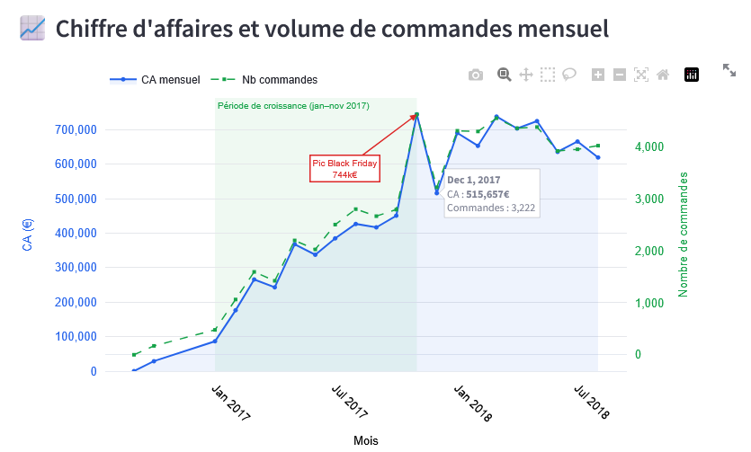
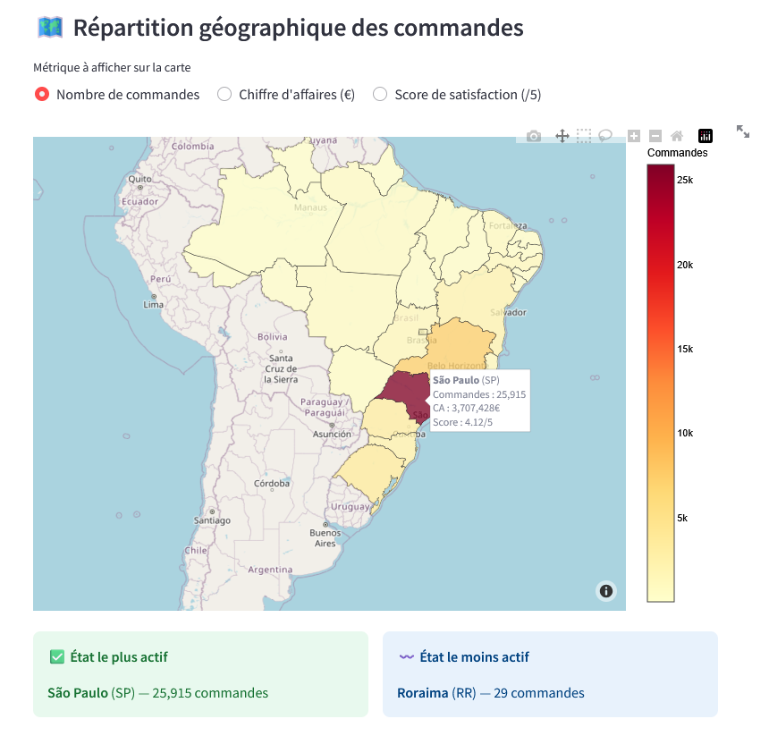
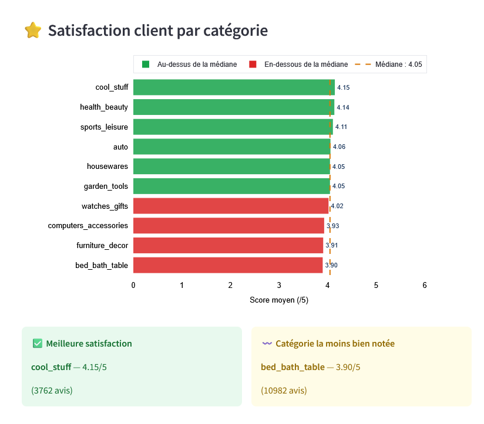
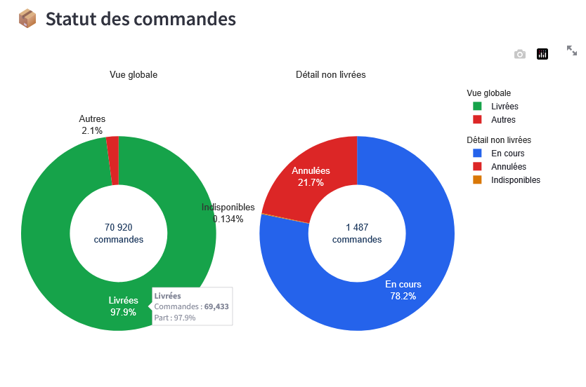

# 🛒 E-Commerce Sales Pipeline — Olist Dataset

> **Pipeline ETL complet d'analyse des ventes e-commerce | End-to-end ETL pipeline for e-commerce sales analysis**


---

## 🇫🇷 Présentation du projet

Ce projet implémente un **pipeline ETL (Extract → Transform → Load → Analyze)** complet sur le dataset public Olist (e-commerce brésilien, ~100 000 commandes), avec un **dashboard interactif Streamlit** pour explorer les données.

L'objectif : transformer des données brutes multi-fichiers CSV en insights business exploitables, stockés en base SQL et visualisés automatiquement.

Ce projet fait écho à mon expérience chez **Bouygues Telecom** (pôle Big Data), où j'ai travaillé sur l'analyse du parcours client et l'efficacité des canaux marketing — ici appliqués à un contexte e-commerce.

### Ce que ce projet démontre

- Conception et orchestration d'un pipeline de données modulaire en Python
- Nettoyage et jointures multi-tables avec Pandas (9 sources hétérogènes)
- Calcul de KPIs e-commerce métier (CA, délais de livraison, top catégories, ticket moyen, frais de port)
- Validation automatique de la qualité des données à chaque étape (`validate.py`)
- Persistance SQL avec SQLite et requêtes analytiques
- Génération automatique de 6 visualisations avec Matplotlib/Seaborn
- Dashboard interactif avec filtres dynamiques, bouton de réinitialisation et console SQL (Streamlit)
- Suite de tests unitaires (15 tests pytest)

---

## 🇬🇧 Project Overview

This project implements a full **ETL pipeline (Extract → Transform → Load → Analyze)** on the public Olist dataset (Brazilian e-commerce, ~100,000 orders), with an **interactive Streamlit dashboard** to explore the data.

The goal: turn raw multi-file CSV data into actionable business insights, stored in a SQL database and automatically visualized.

This project mirrors work done during my 2-year apprenticeship at **Bouygues Telecom** (Big Data division), where I analyzed customer journeys and marketing channel performance — here applied to an e-commerce context.

### What this project demonstrates

- Design and orchestration of a modular data pipeline in Python
- Multi-table cleaning and joins with Pandas (9 heterogeneous sources)
- Business KPI calculation (revenue, delivery time, top categories, average basket, freight ratio)
- Automatic data quality validation at each step (`validate.py`)
- SQL persistence with SQLite and analytical queries
- Automated generation of 6 charts with Matplotlib/Seaborn
- Interactive dashboard with dynamic filters, reset button and SQL console (Streamlit)
- Unit test suite (15 pytest tests)

---

## 🗂️ Project Structure

```
projet-pipeline-data/
│
├── src/
│   ├── extract.py              # Chargement des 9 CSV Olist
│   ├── transform.py            # Nettoyage, jointures, calcul KPIs
│   ├── load.py                 # Sauvegarde SQLite & requêtes SQL
│   ├── analyze.py              # Génération des visualisations
│   └── validate.py             # Validation qualité des données
│
├── tests/
│   └── test_transform.py       # 15 tests unitaires pytest
│
├── data/
│   ├── raw/                    # CSV Olist (non commité — voir section Données)
│   └── processed/
│       └── ecommerce.db        # Base SQLite générée
│
├── outputs/                    # Graphiques générés (PNG)
│
├── .github/
│   └── workflows/
│       └── tests.yml           # CI/CD GitHub Actions
│
├── app.py                      # Dashboard Streamlit
├── main.py                     # Point d'entrée du pipeline
├── Makefile                    # Commandes raccourcies
├── requirements.txt
├── .env.example
└── README.md
```

---

## ⚙️ Pipeline Architecture

```
CSV Files (9 sources Olist)
        │
        ▼
  [ EXTRACT ]   ──── extract.py
  Chargement de tous les datasets en DataFrames Pandas
        │
        ▼
  [ VALIDATE ]  ──── validate.py
  Vérification qualité des données brutes
        │
        ▼
  [ TRANSFORM ] ──── transform.py
  • Nettoyage des dates et valeurs nulles
  • Jointure : orders + items + products + customers + categories
  • Calcul des KPIs : revenue, delivery_days, purchase_month/year
        │
        ▼
  [ VALIDATE ]  ──── validate.py
  Vérification de la table maître
        │
        ▼
  [ LOAD ]      ──── load.py
  Sauvegarde dans SQLite (table orders_master)
        │
        ▼
  [ ANALYZE ]   ──── analyze.py
  Requêtes SQL → 6 graphiques → outputs/
        │
        ▼
  [ DASHBOARD ] ──── app.py
  Streamlit · Filtres dynamiques · Console SQL
```

---

## 📦 Données / Dataset

**Source** : [Olist Brazilian E-Commerce Public Dataset](https://www.kaggle.com/datasets/olistbr/brazilian-ecommerce) — Kaggle  
**Volume** : ~100 000 commandes | 9 tables relationnelles | 2016–2018

| Fichier | Description | Lignes |
|---------|-------------|--------|
| `olist_orders_dataset.csv` | Commandes | 99 441 |
| `olist_order_items_dataset.csv` | Lignes de commande | 112 650 |
| `olist_products_dataset.csv` | Produits | 32 951 |
| `olist_customers_dataset.csv` | Clients | 99 441 |
| `olist_sellers_dataset.csv` | Vendeurs | 3 095 |
| `olist_order_payments_dataset.csv` | Paiements | 103 886 |
| `olist_order_reviews_dataset.csv` | Avis | 99 224 |
| `olist_geolocation_dataset.csv` | Géolocalisation | 1 000 163 |
| `product_category_name_translation.csv` | Traductions catégories | 71 |

> ⚠️ Les fichiers CSV bruts sont exclus du dépôt (`.gitignore`).
> Les télécharger depuis Kaggle et les placer dans `data/raw/`.

---

## 📊 Visualisations — Aperçu du dashboard

Le dashboard contient **9 graphiques interactifs** (Plotly) + une console SQL :

| # | Titre | Description |
|---|-------|-------------|
| 1 | 📈 Chiffre d'affaires mensuel + volume de commandes | Double axe CA/commandes, annotation pic Black Friday, zone de croissance |
| 2 | 🏆 Top catégories par chiffre d'affaires | Barres horizontales, code couleur médiane, slider dynamique |
| 3 | 🚚 Distribution des délais de livraison | Histogramme avec zone livraison rapide, médiane et moyenne |
| 4 | 📦 Délais de livraison par catégorie | Boxplot (Q1, médiane, Q3, outliers) par catégorie |
| 5 | 💸 Part des frais de port dans le CA | Ratio freight/CA (%) avec ligne médiane de référence |
| 6 | 🧾 Ticket moyen par catégorie | Prix moyen avec code couleur au-dessus/en-dessous de la médiane |
| 7 | 📦 Statut des commandes | Double donut : vue globale (livrées vs autres) + détail non livrées |
| 8 | ⭐ Satisfaction client par catégorie | Score moyen des avis (/5) avec ligne médiane |
| 9 | 🗺️ Répartition géographique des commandes | Carte choroplèthe du Brésil par état (commandes, CA ou satisfaction) |
| — | 🧮 Requête SQL personnalisée | Console SQL pour interroger directement `orders_master` |

### 📈 Chiffre d'affaires mensuel
Analyse temporelle du CA avec annotation du pic Black Friday (novembre 2017).


### 🗺️ Répartition géographique
Carte choroplèthe interactive du Brésil — commandes, CA ou satisfaction par état.


### ⭐ Satisfaction client par catégorie
Croisement des données commandes + avis pour identifier les catégories à améliorer.


### 📦 Statut des commandes
Double donut : vue globale (livrées vs autres) et détail des commandes non livrées.


---

## 🧪 Tests / Testing

```bash
python -m pytest tests/ -v
```

```
tests/test_transform.py::TestCleanOrders::test_supprime_lignes_sans_date_achat  PASSED
tests/test_transform.py::TestCleanOrders::test_dates_converties_en_datetime     PASSED
tests/test_transform.py::TestBuildMasterTable::test_retourne_dataframe           PASSED
tests/test_transform.py::TestBuildMasterTable::test_colonnes_essentielles        PASSED
tests/test_transform.py::TestComputeKpis::test_colonne_revenue_creee            PASSED
...
15 passed in 0.41s
```

---

## 🧮 SQL Queries — Exemples / Examples

```sql
-- Chiffre d'affaires par année
SELECT purchase_year,
       COUNT(DISTINCT order_id) AS nb_commandes,
       ROUND(SUM(revenue), 2)   AS chiffre_affaires
FROM orders_master
GROUP BY purchase_year
ORDER BY purchase_year;

-- Top 10 catégories par CA
SELECT product_category_name_english AS categorie,
       ROUND(SUM(revenue), 2) AS chiffre_affaires
FROM orders_master
WHERE product_category_name_english IS NOT NULL
GROUP BY categorie
ORDER BY chiffre_affaires DESC
LIMIT 10;
```

---

## 🚀 Installation & Lancement / Getting Started

### Prérequis / Prerequisites
- Python 3.11+
- pip
- `make` — Windows : `winget install GnuWin32.Make` | Mac/Linux : déjà installé
- [Dataset Olist](https://www.kaggle.com/datasets/olistbr/brazilian-ecommerce) — placer les CSV dans `data/raw/`

### Étapes / Steps

```bash
# 1. Cloner le dépôt
git clone https://github.com/PhilippeMARTINS/projet-pipeline-data.git
cd projet-pipeline-data

# 2. Créer et activer l'environnement virtuel
python -m venv venv
venv\Scripts\activate        # Windows
# source venv/bin/activate   # Mac/Linux

# 3. Installer les dépendances
pip install -r requirements.txt

# 4. Configurer les variables d'environnement
cp .env.example .env         # puis adapter si nécessaire

# 5. Lancer le pipeline ETL complet
python main.py

# 6. Lancer le dashboard
streamlit run app.py
```

### Commandes Makefile

```bash
make install    # Installe les dépendances
make run        # Lance le pipeline ETL
make dashboard  # Lance le dashboard Streamlit
make test       # Lance les tests pytest
make clean      # Nettoie les fichiers temporaires
```

> ⚠️ Ne jamais copier le dossier `venv/` d'un PC à l'autre — toujours le recréer localement.

---

## 🛠️ Tech Stack

| Outil | Usage |
|-------|-------|
| **Python 3.11** | Langage principal |
| **Pandas 2.2** | Manipulation & nettoyage des données |
| **SQLite** | Stockage relationnel & requêtes analytiques |
| **Matplotlib 3.8** | Génération des graphiques statiques (outputs/) |
| **Seaborn 0.13** | Visualisation statistique |
| **Plotly** | Graphiques interactifs du dashboard |
| **Streamlit 1.32** | Dashboard interactif |
| **pytest** | Tests unitaires |

---

## 👤 Auteur / Author

**Philippe Morais Martins** — Data Engineer / Scientist
M2 Data Engineering · Paris Ynov Campus
Anglais courant · Portugais bilingue

📧 philippe.martins@hotmail.com
🔗 [LinkedIn](https://www.linkedin.com/in/philippe-morais-martins/)
💻 [GitHub](https://github.com/PhilippeMARTINS)
